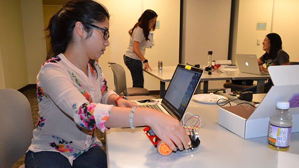
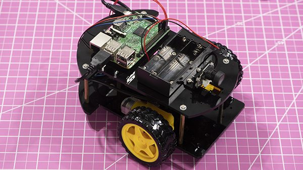

<!--

*** Resources
*** =========
*** In here, you'll find demo code and resources for making sample projects with the Raspberry Pi. For getting started help and tutorials see the [Wiki](https://github.com/acrobotic/EduKits/wiki/).
-->

<!-- PROJECT LOGO -->
 

  

  <h3 align="center">ACROBOTIC EduKit Modules</h3>

  

    A series of Educational Modules for experimenting with programming and electronics!
     
    <a href="https://github.com/acrobotic/EduKits/wiki"><strong>Explore the docs »</strong></a>
     
     
    <a href="https://acrobotic.com/EduKits">Get Hardware</a>
    · <a href="https://github.com/acrobotic/EduKits/issues">Report Bug</a>
    · <a href="https://github.com/acrobotic/EduKits/issues">Request Feature</a>
  

<!-- TABLE OF CONTENTS -->
## Table of Contents

* [Overview](#overview)
  * [Built With](#built-with)
* [Getting Started](#getting-started)
  * [Prerequisites](#prerequisites)
  * [Installation](#installation)
* [Usage](#usage)
* [License](#license)
* [Contact](#contact)
* [Acknowledgements](#acknowledgements)

<!-- ABOUT THE PROJECT -->
## Overview

  

The goal of the **EduKit Modules** is to serve as a platform for student engagement. Based on the **Raspberry Pi** single-board computer, these kits aim to intrigue potential learners and spark a curiosity for innovation!

When students are free to invent and create, they begin to see technology as a set of tools for solving real-world problems, and in the process, they take their learning to the next level.

The use of programmable electronics as a hands-on learning tool makes for an excellen creative medium for advancing teaching and learning. The curricula and resources are designed specifically to help today’s students build skills for the creative and digital economy — critical thinking, collaboration, communication, curiosity, problem solving and invention.

### Built With

  

The different **EduKit Modules** are built using the fantastic **[Raspberry Pi](https://raspberrypi.org)**, a $35 credit card-sized Single-Board Computer able to:

* Run an **Operating System**, typically Linux
* Communicate with **Electronic Hardware** such as LEDs, motors, sensors, and many more
* Rely on community-backed, Open-Source software and hardware to facilitate building fun **DIY Projects**!

Despite specific differences, all **EduKit Modules** are developed using a common set of tools and components. The objective is to have users be able to learn the fundamentals of use once, and easily apply them to different projects—allowing them to focus on learning the subject matters rather than single-use software and hardware tools. These include:

* **[Python Programming Language](https://www.python.org/)**
* **[Jupyter Notebooks](https://jupyter.org/)**
* **[DIY Electronics (sensors, interfaces and actuators)](https://acrobotic.com)**
* **[Web Technologies](https://developer.mozilla.org/en-US/docs/Web)**
* **[Data Processing and Visualization Tools](https://www.nihlibrary.nih.gov/services/data/data-services-tools)**

### List of EduKit Modules
The goal is to develop as many modules as possible, each one focused around learning a specific subject matter. So far, they include:

* **[PhysComp: Intro to Physical Computing]()**
* **[Robocar: Intro to Reinforcement Learning]()**

<!-- GETTING STARTED -->
## Getting Started

### Prerequisites

...

### Installation

...

<!-- USAGE EXAMPLES -->
## Usage

...

_For more examples, please refer to the [Wiki](https://github.com/acrobotic/EduKits/wiki)_

<!-- CONTRIBUTING -->
## Contributing

Contributions are what make the open source community such an amazing place to be learn, inspire, and create. Any contributions you make are **greatly appreciated**.

1. Fork the Project
2. Create your Feature Branch (`git checkout -b feature/AmazingFeature`)
3. Commit your Changes (`git commit -m 'Add some AmazingFeature'`)
4. Push to the Branch (`git push origin feature/AmazingFeature`)
5. Open a Pull Request

<!-- LICENSE -->
## License

Distributed under the MIT License. See `LICENSE` for more information.

<!-- CONTACT -->
## Contact

Your Name - [@acrobotic](https://twitter.com/acrobotic) – support@acrobotic.com

Project Link: [https://github.com/acrobotic/EduKits](https://github.com/acrobotic/EduKits)

Support: [https://discord.gg/hbGxaa](https://discord.gg/hbGxaa)

<!-- ACKNOWLEDGEMENTS -->
## Acknowledgements
* [Donkey Car Project](https://www.webpagefx.com/tools/emoji-cheat-sheet)

<!-- MARKDOWN LINKS & IMAGES -->
<!-- https://www.markdownguide.org/basic-syntax/#reference-style-links -->
[license-shield]: https://img.shields.io/github/license/othneildrew/Best-README-Template.svg?style=flat-square
[license-url]: https://github.com/othneildrew/Best-README-Template/blob/master/LICENSE.txt
[linkedin-shield]: https://img.shields.io/badge/-LinkedIn-black.svg?style=flat-square&logo=linkedin&colorB=555
[linkedin-url]: https://linkedin.com/in/othneildrew